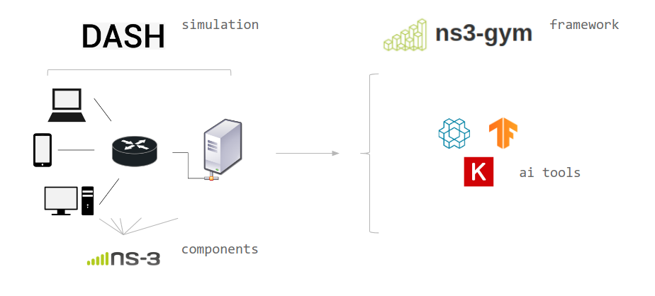
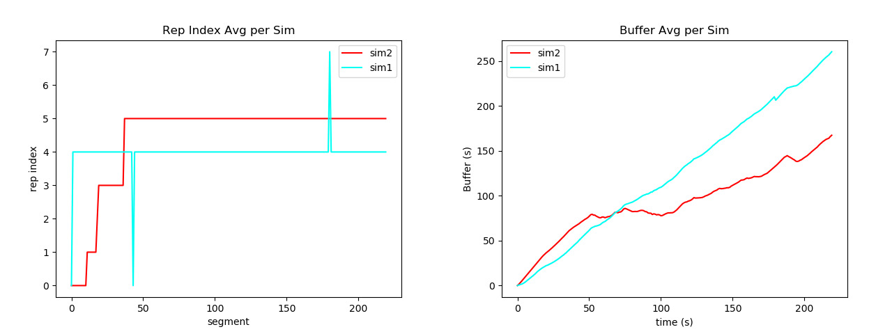

# DASH meets ns3-gym

> Combine discrete video streaming with a framework for Machine Learning.





### Installation


1. Install/setup [ns-3](https://www.nsnam.org/wiki/Installation) ( >= version 3.27)

2. Install/setup [ns3-gym](https://github.com/tkn-tub/ns3-gym) 

3. Clone this repo into `contrib/` folder


## Description

This project combines two projects into one extensible, approachable plugin. DASH ns3 is a simulation model for HTTP-based adaptive streaming applications, and ns3-gym is a framework that integrates both OpenAI Gym and ns-3 in order to encourage usage of RL in networking research.

DASH meets ns3gym will allow users to research and develope competetive HAS (http based adaptive streaming) algorithms in a discrete, controlled, scalable way. 


## Program Execution

### 1. DASH Simulation

From the base directory of ns3 framework, run:

```bash
./waf --run="tcp-stream --simulationId=1 --numberOfClients=1 --adaptationAlgo=rl-algorithm --segmentDuration=2000000 --segmentSizeFile=contrib/dash-meets-ns3gym/segmentSizes.txt"
```
Other simutlations, replace `tcp-stream`

1. `tcp-stream-ethernet`
  - Run the simulation on direct ethernet connection to server

2. `tcp-stream-bitrate`
  - Run simultation with user defined server connection bitrate
  - Add arguments `--bitRate=<int>~`
  - default: `100000` (kb/s)

3. `tcp-stream-interrupts`
  - Run simulation with random requests from N other clients 
  - Add arguments `--interrupts=<int>` 


#### Parameters 
- simulationId 
- numberOfClients
- segmentDuration
  - The duration of a segment in microseconds.
- adaptationAlgo: 
  - The name of the adaptation algorithm the client uses for the simulation. The 'pre-installed' algorithms are tobasco, festive and panda.
- segmentSizeFile
  - The relative path (from the ns-3.x/ folder) of the file containing the sizes of the segments of the video. The segment sizes have to be provided as a (n, m) matrix, with n being the number of representation levels and m being the total number of segments. A two-segment long, three representations containing segment size file would look like the following:

 1564 22394  
 1627 46529  
 1987 121606  

### 2. RL Agent

In another Terminal, run one of the following examples, or implement your own.

>  sim1: simple NN, sim2: pensive 



### Pensive 


> MIT CSAIL Labratories, [link](http://web.mit.edu/pensieve/)

The fully functioning, pretrained Actor/Critic Neural Network developed by the MIT CSAIL Labratories is implemented.

#### How to Run

1. Run ns3 simulation above `./waf --run=...`

2. Run pensive in seperate terminal

`$ cd /ns3gym/pensive`
`$ python pensive.py`

3. Optional, create simulation video (only linux)
  - Add arg `--animate=<video_filename>`


### Simple-NN 

This NN exhibits reinforcement learning applied to this problem in limited scope, no learning occurs in context of entire simulation, just state in every iteration.

#### How to Run

1. Run ns3 simulation above `./waf --run=...`

2. Run simple NN in seperate terminal

- `$ cd /ns3gym/simple-nn`
- `$ python simple-nn.py [--args x]`

#### Command line arguments are as follows

- `-h` : print help
- `--episodes=<int>`: Number of simulations to train/test, default 1
- `--segmentSizeFile=<filename>`: Filepath of segment sizes, default is segmentSizeFile
- `--saveModel=<filename>`: filename of trained model to save, default is no save.
- `--useModel=<filename>`:  filename of trained model to use, default is no model.
- `--reward=<reward>`: Choose reward function, [rebuff, quality, hd, log, default]
- `--animate=<video_filename>`: create simulation video

## Technical Overview

Using ns3gym, an ns3 discrete network simulation may be extended to use python ai learning tools, such as openAI gym. 

Ns3gym uses zmq tcp socket connection to create a gateway and agent entity, the gateway (built into ns3) will send the current state of the simulation at every discrete iteration  to the agent (seperate python script).

Dash-meets-ns3gym is a framework where all simulations and data endpoints are constructed to represent video information being streamed in a HTTP like environment.

Using this project will allow you to create RL algorithms to learn better HAS algorthms

### Observation Space

The gateway sends observations every iteration to the agent to process. The observation space represents video data during streaming and is defined as follows

  - buffer : Current amount of video in client buffer (ns)
  - lastRequest: Current index in total video
  - lastquality: Last requested video quality
  - lastChunkFinishTime: Time (ns) when last download completed
  - lastChunkStartTime: Time (ns) when last download started
  - RebufferTime: Time spent (ns) with no data in buffer
  - lastChunkSize: in bytes


## Reference 

- "Simulation Framework for HTTP-Based Adaptive Streaming Applications" by Harald Ott, Konstantin Miller, and Adam Wolisz, 2017


## Contact

* Peter Bangert, TU-Berlin, petbangert@gmail.com
