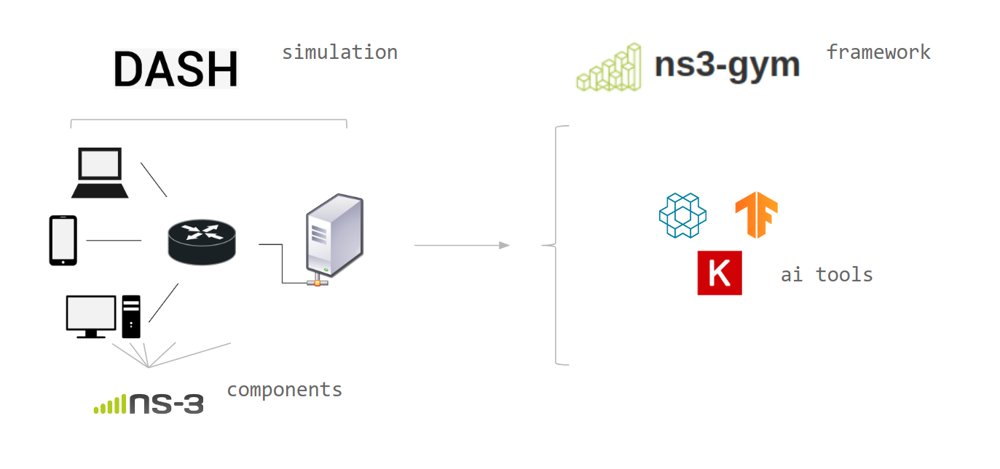

# DASH meets ns3-gym

> Combine discrete video streaming with a framework for Machine Learning.





### Installation


1. Install/setup [ns-3](https://www.nsnam.org/wiki/Installation) ( >= version 3.27)

2. Install/setup [ns3-gym](https://github.com/tkn-tub/ns3-gym) 

3. Clone this repo into `contrib/` folder


## Description

This project combines two projects into one extensible, approachable plugin. DASH ns3 is a simulation model for HTTP-based adaptive streaming applications, and ns3-gym is a framework that integrates both OpenAI Gym and ns-3 in order to encourage usage of RL in networking research.

DASH meets ns3gym will allow users to research and develope competetive HAS (http based adaptive streaming) algorithms in a discrete, controlled, scalable way. 


## Program Execution

#### Example

```bash
./waf --run="tcp-stream --simulationId=1 --numberOfClients=1 --adaptationAlgo=rl-algorithm --segmentDuration=2000000 --segmentSizeFile=contrib/dash/segmentSizes.txt"
```


### Parameters 
- simulationId 
- numberOfClients
- segmentDuration
  - The duration of a segment in microseconds.
- adaptationAlgo: 
  - The name of the adaptation algorithm the client uses for the simulation. The 'pre-installed' algorithms are tobasco, festive and panda.
- segmentSizeFile
  - The relative path (from the ns-3.x/ folder) of the file containing the sizes of the segments of the video. The segment sizes have to be provided as a (n, m) matrix, with n being the number of representation levels and m being the total number of segments. A two-segment long, three representations containing segment size file would look like the following:

 1564 22394  
 1627 46529  
 1987 121606  

## Examples

### Pensive 

> MIT CSAIL Labratories, [link](http://web.mit.edu/pensieve/)

The fully functioning, pretrained Actor/Critic Neural Network developed by the MIT CSAIL Labratories is implemented.


## Reference 

- "Simulation Framework for HTTP-Based Adaptive Streaming Applications" by Harald Ott, Konstantin Miller, and Adam Wolisz, 2017


## Contact

* Peter Bangert, TU-Berlin, petbangert@gmail.com
